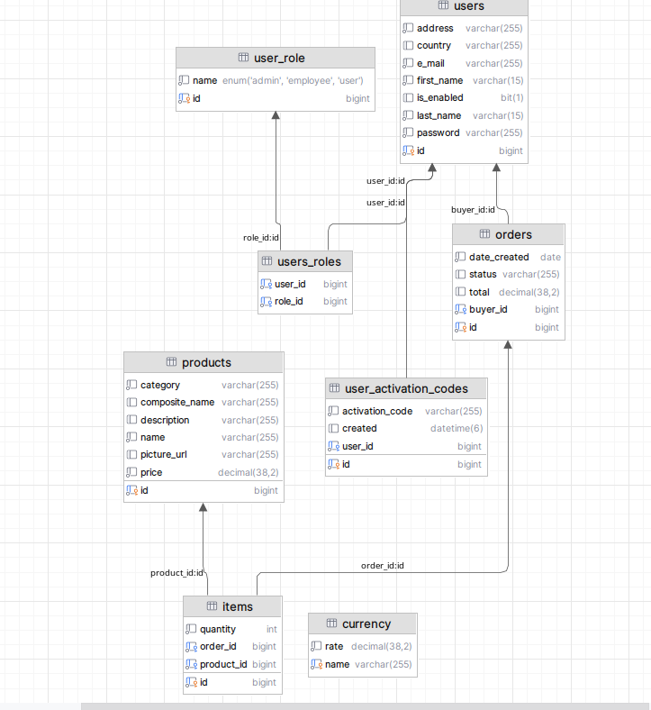
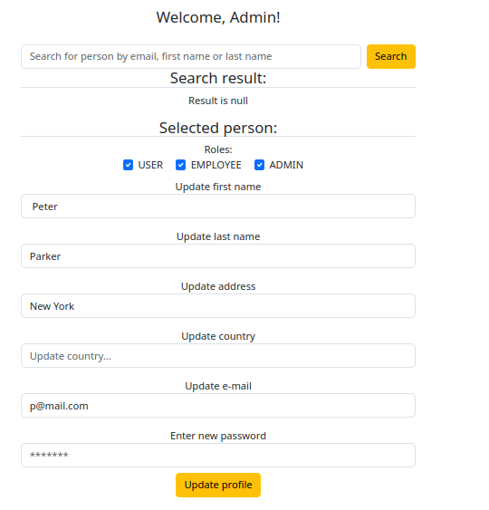
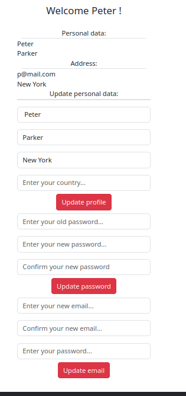

# bikes-shop
Web-app for a bicycle shop 🚴‍♂️

- ✅ Spring Boot project
- ✅ Role based access with Spring Security
- ✅ Events, Scheduelers, Cashe
- ✅ REST APIs
- ✅ Cookies

✏️ Planned deployment to Azure
✏️ Planned internationalisation

*** Moved from [here](https://github.com/PetyaKancheva/Spring-Web/tree/main/bikes-shop) ***   
*** run with [comments-server](https://github.com/PetyaKancheva/Spring-Web/tree/main/comments-project) ***

#### Snippets

- test coverage  

- database  

- login  

- register  

- update profile by admin  

- update profile by user  

